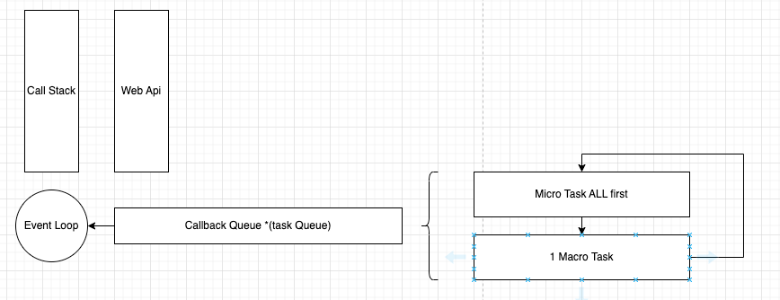

## Javascript
- Q: What are closures in JavaScript? How do they work and what are some use cases?
  - A: Closures in JavaScript are functions that retain access to variables from their outer scope, even after the outer function has finished executing. They are useful for data privacy, function factories, callback functions, and memoization.
- Q: Explain the event loop in JavaScript and how it manages asynchronous operations.
  - https://developer.mozilla.org/en-US/docs/Web/JavaScript/Inheritance_and_the_prototype_chain
  - https://medium.com/sessionstack-blog/how-javascript-works-event-loop-and-the-rise-of-async-programming-5-ways-to-better-coding-with-2f077c4438b5
  - 
- Q: What is the difference between prototypal inheritance and classical inheritance in JavaScript?
  - Prototypal Inheritance: JavaScript natively uses prototypal inheritance. Every object in JavaScript has a prototype which is just another object to which the object is linked. When a property or a method is not found in an object, JavaScript will look for it in the object's prototype, then in the prototype's prototype, and so on, up the chain until it either finds what it's looking for or reaches an object with a null prototype (like Object.prototype). This prototype chain is the equivalent of the inheritance chain in class-based languages. This allows you to create an object based on another object without the need for defining classes.
- Q: What is the purpose of the "this" keyword in JavaScript? How does its value get determined?
  - The this keyword in JavaScript is a special keyword that represents the context in which a function is called. It's a reference to the object that the function is a property of.
- Q: How does hoisting work in JavaScript? Provide examples to illustrate your explanation.
  - Hoisting in JavaScript is a behavior where variable and function declarations are moved to the top of their containing scope during the compile phase, before the code has been executed. It's important to note that only the declarations are hoisted, not initializations.
- Q: Explain the concept of promises in JavaScript and how they relate to asynchronous programming.
  - A promise in JavaScript represents the eventual completion (or failure) of an asynchronous operation and its resulting value. It's a placeholder for a value that is not yet known, often because it's being retrieved or computed asynchronously. Promises are used to handle asynchronous operations in JavaScript, such as web requests, reading files, querying a database, or timeouts. They provide a better way to deal with the async operations as compared to traditional callback functions, by avoiding callback hell and providing better error handling.
- Q: What are generators in JavaScript? How do they differ from regular functions?
  - Generators are special kinds of functions in JavaScript that allow you to pause and resume execution at specific points. Unlike regular functions that run to completion when called, generators can be paused midway, and then resumed, maintaining their internal state between pauses. This feature opens up a lot of potential for handling asynchronous tasks, controlling flow in complex sequences, and other cases where it's useful to have a "stateful" function.
  - ```js
    function* numberGenerator() {
       yield 1;
       yield 2;
       yield 3;
    }
    const gen = numberGenerator();  // This returns an iterator
    console.log(gen.next()); // { value: 1, done: false }
    console.log(gen.next()); // { value: 2, done: false }
    console.log(gen.next()); // { value: 3, done: false }
    console.log(gen.next()); // { value: undefined, done: true }
    ```
- Q: Describe the different methods for handling errors in JavaScript, including try/catch, throw, and error objects.
  - try/catch/finally, throw, and Error objects.
- Q: What is the purpose of the "use strict" directive in JavaScript? How does it affect the behavior of the code?
  - The "use strict" directive in JavaScript is used to enforce stricter parsing and error handling in your code. It was introduced to help catch common coding mistakes and "unsafe" actions such as accessing global objects. This directive can be added at the beginning of a script or a function.
- Q: Explain the concept of event delegation in JavaScript and how it can be used for efficient event handling.
  - Event delegation is a pattern in JavaScript where you delegate the handling of events to a parent element instead of assigning event handlers to individual elements. This technique leverages the fact that most events in JavaScript bubble up through the DOM tree. When an event fires on a child element, if it's not handled there, the event propagates up to the parent element, and up through its ancestors, until it reaches the top of the DOM tree or is explicitly stopped.
- Q: What are the differences between the "var," "let," and "const" keywords in JavaScript? When should each one be used?
  - `var` - functional scope (or global), hoisting
  - `const`, `let` - block scoped, `let` should be used in case re-assignment required.
  - Q: How does the concept of lexical scoping work in JavaScript? Provide an example to demonstrate its behavior.
    - Lexical scoping (also known as static scoping) is a fundamental concept in JavaScript and many other programming languages. It defines how variable names are resolved in nested functions: inner functions contain the scope of parent functions even if the parent function has finished executing.
    - ```js
       let outerVar = 'I am outside!';
       function outerFunction() {
           let innerVar = 'I am inside!';
           function innerFunction() {
               console.log(outerVar); // I am outside!
               console.log(innerVar); // I am inside!
           }
         
           innerFunction();
      }
      outerFunction();
     ```
- Q: Explain the concept of currying in JavaScript and provide an example of how it can be implemented.
  - Currying is a functional programming concept where a function with multiple arguments is transformed into a sequence of functions, each taking a single argument. Each function returns a new function that takes the next argument until all arguments are exhausted, at which point the original function is executed with all provided arguments.
  - ```js
    function multiply(a) {
      return function(b) {
      return a * b;
      }
    }
    
    const multiplyByTwo = multiply(2); // Returns a function that accepts one argument
    console.log(multiplyByTwo(5)); // Outputs 10
    ```
- Q: How does the module pattern work in JavaScript? How does it promote encapsulation and modularity in code?
  - The Module pattern in JavaScript is a design pattern that uses the concept of closures and immediately invoked function expressions (IIFE) to create private states and behaviors. This pattern promotes encapsulation and modularity by providing a way to encapsulate methods and variables within a single scope, allowing us to package up variables and functionality into neatly separated parts of our application.
- Q: What are the different ways to create objects in JavaScript? Compare and contrast each approach.
  - `Object Literals`
  - `Constructor Functions`
  - `Object.create()`
  - `ES6 Classes`
- Q: Explain the concept of memoization in JavaScript. How can it be used to optimize performance?
  - Memoization is a technique used in computer programming to optimize program speed by storing the results of expensive function calls and reusing them when the same inputs occur again. This is a form of caching where the return value of a function based on its parameters is stored for later use.
- Q: What is the event bubbling and event capturing in JavaScript? How does the event propagation model work?
  - Event bubbling and event capturing are two ways of event propagation in the HTML DOM API when an event occurs in an element that is nested inside another element, and both elements have registered a handle for that event.
- Q: Discuss the concept of "hoisting" in JavaScript and its impact on variable and function declarations.
  - Hoisting is a JavaScript mechanism where variables and function declarations are moved to the top of their containing scope during the compile phase, before the code has been executed.
- Q: Describe the concept of Web Workers in JavaScript. How can they be used to perform parallel processing in the browser?
  - Web Workers are a feature in JavaScript that enable parallel processing in the browser. They allow you to execute scripts in the background without blocking the main user interface (UI) thread, thus preventing the UI from becoming unresponsive.
- Q: Explain the concept of functional composition in JavaScript. How can you compose multiple functions to create more complex behavior?
  - Functional composition in JavaScript is a technique that involves combining multiple functions together to create a new function that performs a series of operations or transformations. It allows you to create more complex behavior by chaining or nesting functions in a declarative and reusable manner.
- Q: What are the differences between a function declaration and a function expression in JavaScript? How do they affect hoisting and scope?
  - Declaration `function smth() {}` (hoisted)
  - Expression `const b = function() {}`(not-hoisted)
- Q: Discuss the concept of event-driven programming in JavaScript. How does it relate to event handling and asynchronous programming?
  - Event-driven programming in JavaScript is a programming paradigm that focuses on responding to and handling events that occur during the execution of a program. It revolves around the idea of triggering actions or executing code based on specific events rather than following a predefined sequential flow.
- Q: Discuss the concept of WebSockets in JavaScript. How can you use WebSockets to establish a persistent connection for real-time communication?
  - WebSockets in JavaScript provide a persistent, two-way communication channel between a client (typically a web browser) and a server. Unlike traditional HTTP requests that are based on a request-response model, WebSockets allow for real-time, bi-directional communication, making them ideal for applications that require instant updates or real-time data synchronization.
  - Key aspects of WebSockets:
  - Persistent Connection: WebSockets establish a long-lived connection between the client and the server. Once the connection is established, it remains open, allowing for continuous communication between both sides.
  - Bi-directional Communication: With WebSockets, both the client and the server can send and receive data at any time, enabling real-time communication. This is in contrast to the request-response model of traditional HTTP, where the server can only respond to client requests.
  - Lightweight Overhead: WebSockets have a relatively low overhead compared to protocols like HTTP. The WebSocket protocol reduces unnecessary headers and provides a more efficient data transfer mechanism, allowing for faster and more lightweight communication.
  - Event-Driven Communication: WebSockets are event-driven. The client and server can exchange messages as discrete events, allowing the server to push data to the client without the client needing to make explicit requests.
- Q: Explain the concept of the DOM (Document Object Model) in JavaScript. How can you manipulate and traverse the DOM effectively?
  - The DOM (Document Object Model) in JavaScript is a programming interface that represents the structure of an HTML or XML document as a tree-like object. It provides a way to interact with and manipulate the content, structure, and style of a web page dynamically.
- Q: Discuss the concept of function chaining in JavaScript. How can you chain multiple function calls together to achieve a desired outcome?
  ```js
  const result = calculator.add(5).multiply(2).subtract(3).divide(2);
  ```
### TODO
- ✅Q: Discuss the concept of functional programming in JavaScript. What are pure functions, immutability, and higher-order functions?
- ✅Q: Explain the concept of debouncing and throttling in JavaScript. How can they be used to optimize performance in event handling?
- ✅Q: Describe the role of the "prototype" property in JavaScript. How does it relate to object inheritance and method sharing?
- ✅Q: What are the differences between shallow copying and deep copying objects in JavaScript? How can you achieve each type of copy?
- ✅Q: Discuss the concept of functional programming in JavaScript. What are pure functions, immutability, and higher-order functions?
- ✅Q: Explain the concept of event-driven programming in JavaScript. How can you utilize events and event listeners effectively?
- ✅Q: What are some techniques for optimizing JavaScript code for performance? Discuss strategies such as code profiling, caching, and minimizing DOM manipulation.
- ✅Q: Discuss the differences between the "==" and "===" operators in JavaScript. When should each one be used?
- ✅Q: What are the differences between the "call," "apply," and "bind" methods in JavaScript? How do they relate to function invocation and context binding?
- ✅Q: What are some common design patterns used in JavaScript development? Explain the Observer, Singleton, and Factory patterns.
- ✅Q: Explain the concept of IIFE (Immediately Invoked Function Expression) in JavaScript. What are its benefits and how is it different from regular function invocation?
- ✅Q: What are the differences between the "map," "filter," and "reduce" methods in JavaScript? Provide examples of how each method can be used.
- ✅Q: Explain the concept of prototypal inheritance in JavaScript. How does the prototype chain work when accessing properties and methods?
- ✅Q: Explain the differences between the spread operator (...) and the rest parameters in JavaScript. How can they be used effectively?
- ✅Q: Discuss the concept of lazy loading in JavaScript. How can you implement lazy loading for assets, modules, or components?
- ✅Q: What are the differences between the "for...in" loop and the "for...of" loop in JavaScript? When should each loop be used?
- ✅Q: What are the differences between arrow functions and regular functions in JavaScript? How do arrow functions handle "this" binding?
- ✅Q: What are the different ways to handle AJAX requests in JavaScript? Compare and contrast XMLHttpRequest, Fetch API, and Axios.

